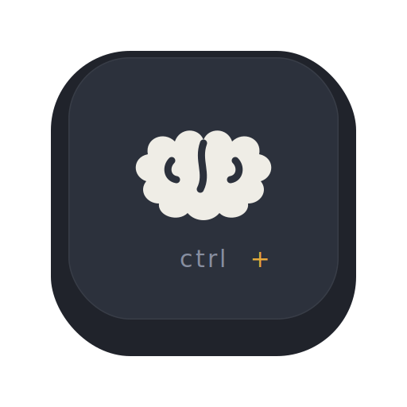

<div align="center">
  
  <h1>Ctrl+Brain</h1>
  <p><strong>Your second brain, one keystroke away.</strong></p>
</div>

A tiny macOS menu-bar agent. Press **⌃⇧2** anywhere and Ctrl+Brain captures the
selected text, image, or screenshot — OCRs it, describes it with a local model,
saves it to one editable Markdown document, and syncs it to your Supermemory.

## Requirements

- macOS 13 or newer
- Xcode Command Line Tools (`xcode-select --install`)
- A local describe backend: Claude CLI or Codex CLI available on `PATH`
- Optional: a Supermemory API key for sync

## What it does

Press **Control+Shift+2** (the shortcut is customizable) anywhere:

- **Selected text** is read via the Accessibility API (with a synthetic ⌘C
  fallback for browsers) and saved with its source URL — exact, no OCR.
- **Images / screenshots** are OCR'd on-device with **Apple Vision**, described
  by a local **Claude / Codex CLI**, and saved.
- **Nothing selected?** The native screenshot picker opens; the region you grab
  is captured the same way.

Everything lands in one rolling, **editable** document and uploads to
Supermemory:

```
~/SecondBrain/captures/SecondBrain.mdx
```

Open the menu-bar item → **Open** to browse it. The viewer renders the Markdown
cleanly (headings, captions, inline images — no raw syntax), is fully editable
with autosave, and live-updates as new captures arrive.

## Build & run

```bash
cp .env.example .env # optional, for Supermemory sync / backend selection
chmod +x build.sh && ./build.sh
open "Ctrl+Brain.app"
```

No Xcode project — it compiles with `clang` and is signed with a local
self-signed identity so permission grants persist across rebuilds.

First run requires macOS permissions (granted once, then they stick):

- **Accessibility** — for reading the selection and the synthetic ⌘C.
- **Screen Recording** — only for the screenshot picker.
- **Automation** (optional) — source-URL detection in Safari / Chrome / Arc.

After the first run, Ctrl+Brain installs a per-user LaunchAgent so it starts
automatically in the background when you log in to your Mac.

## Settings

Menu-bar icon → **Settings…** (or ⌘,):

- **Container tag** — groups captures in Supermemory and is written into the
  document frontmatter; applied to every capture. Default `my-second-brain`.
- **Capture shortcut** — click the recorder and press any combo (needs a
  modifier). Default `⌃⇧2`. Re-binds live.

The Supermemory API key is read from `SUPERMEMORY_API_KEY`, then from a `.env`
file (cwd, the app bundle's Resources, the bundle's parent dir,
`~/SecondBrain/.env`, or `~/.config/ctrlbrain/.env`).

Set `CTRL_BRAIN_DESCRIBE_BACKEND=claude` or `CTRL_BRAIN_DESCRIBE_BACKEND=codex`
to choose the image-description backend. Ctrl+Brain searches common Homebrew,
npm, nvm, asdf, bun, cargo, and local-bin paths so GUI launches can still find
the selected CLI.

## Project layout

| File | Role |
|------|------|
| `main.m`, `AppDelegate.{h,m}` | The whole app: hotkey, capture, OCR, describe, upload, viewer, settings |
| `Info.plist` | Bundle config (`LSUIElement`, app icon) |
| `build.sh` | `clang` build, ad-hoc/self-signed code-sign, bundles `.env` + logo + icon |
| `assets/` | `logo.svg`, generated `AppIcon.icns` |
| `web/` | Next.js landing site |
| `.env.example` | Local configuration template |

## Open source

Ctrl+Brain is released under the MIT License. See `CONTRIBUTING.md`,
`SECURITY.md`, and `THIRD_PARTY_NOTICES.md` before opening issues or pull
requests.
